<a href="https://github.com/zuhairadnansutrisno2502-lab?tab=repositories"></a>

I mostly make small command-line tools that poke fun at git, plus one that keeps my coding agent honest. Each runs with a single `npx`, nothing to install. These days most of my spare time goes into Roblox games written in Luau.

<sub>TypeScript · Node.js · Luau · Roblox Studio · Swift · Python</sub>

### Selected work

<a href="https://github.com/zuhairadnansutrisno2502-lab/trust-issues"></a>

<details>
<summary>Watch it catch one</summary>
<br>


```bash
npx trust-issues
```

</details>

<a href="https://github.com/zuhairadnansutrisno2502-lab/git-sorry"></a>

<details>
<summary>Watch it run</summary>
<br>


```bash
npx git-sorry
```

</details>

<a href="https://github.com/zuhairadnansutrisno2502-lab/blame-roulette"></a>

<details>
<summary>Watch it run</summary>
<br>


```bash
npx blame-roulette expressjs/express
```

</details>

<a href="https://github.com/zuhairadnansutrisno2502-lab/notmymachine"></a>

<details>
<summary>See a real run</summary>

```
  BREAK   Timezone UTC+14 Pacific/Kiritimati exit 1
          It is already tomorrow there, so anything that reads "today"
          off the system clock lands on a different calendar day.

  BREAK   German locale decimal comma, dd.mm.yyyy exit 1
          | 1.2345 !== 1234.5

  pass    Timezone UTC+5:45 Asia/Kathmandu 0.1s
  pass    Empty home directory fresh HOME and XDG dirs 0.1s

  3 of 10 worlds break this suite.
```

```bash
npx notmymachine
```

</details>
